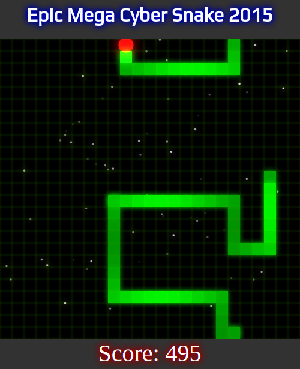

# Web Component Snake

## Introduction

This is a personal project that I've used for teaching myself how to build, access and interconnect Web Components using the Polymer framework.
This project just happens to be a snake game, since it's a problem of a very limited scope, and thus easy for me to get my head around. On the other hand, it provides good opportunities for studying web components, in that each part of the problem is cleanly separable and communication between parts can be externalized.

For you, as an anonymous end user, this can serve as an example of how to create a web component

## Requirements

This game has been tested to work on Chrome 46 and Firefox 41. Your mileage may vary.
Compilation uses GNU Make and the [TypeScript](http://www.typescriptlang.org/) compiler installed along the PATH.

## Screenshot

## Try it

Play the compiled game [here](http://uncoolbens.org/snake/)

## Limitations

The page needs to be reloaded to restart the game. The aim of this exercise was not to create a game, but to wire up web components in a usable fashion.

## Acnowledgements 

The favicon I'm using is from [IconArchive](http://www.iconarchive.com/show/animal-icons-by-martin-berube/snake-icon.html) - it is licensed as freeware.
The WebFont is from Google's Web Fonts repository, and it's called [Play](https://www.google.com/fonts/specimen/Play), and is licensed under the SIL Open Font License.

